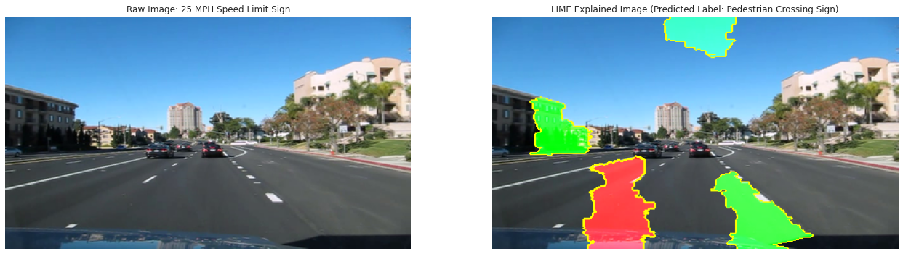

# Getting Started

## Obtain/Scrub

If you want to follow along in your own drive, the first step you'll need to take is to download the LISA dataset. Click [here](https://drive.google.com/file/d/1vdfuAMbCdKFt_hn_10zkzV258VUJHNCO/view?usp=sharing) to access a modified version of the zip file to place in your own Google Drive. This modified zip file contains an additional set of screenshots from Google Images and Google Street View, located in the folder `prediction_images`. 

Once the zip file is in the Drive directory you want it in, the following blocks of code will unzip the data within Google Colab.


```python
from google.colab import drive
drive.mount('/gdrive',force_remount=True)
%cd ~
%cd ..
```

    Go to this URL in a browser: https://accounts.google.com/o/oauth2/auth?client_id=947318989803-6bn6qk8qdgf4n4g3pfee6491hc0brc4i.apps.googleusercontent.com&redirect_uri=urn%3aietf%3awg%3aoauth%3a2.0%3aoob&response_type=code&scope=email%20https%3a%2f%2fwww.googleapis.com%2fauth%2fdocs.test%20https%3a%2f%2fwww.googleapis.com%2fauth%2fdrive%20https%3a%2f%2fwww.googleapis.com%2fauth%2fdrive.photos.readonly%20https%3a%2f%2fwww.googleapis.com%2fauth%2fpeopleapi.readonly
    
    Enter your authorization code:
    ··········
    Mounted at /gdrive
    /root
    /
    


```python
import os,glob

print(os.path.abspath(os.curdir))

# change the next line of code to reflect the location of the zip file in your own Drive
source_folder = r'/gdrive/My Drive/Datasets/' 
file = glob.glob(source_folder+'*.zip',recursive=True)[0]
file
```

    /
    


    '/gdrive/My Drive/Datasets/LISA_dataset.zip'


```python
zip_path = file

!cp "{zip_path}" .

!unzip -q LISA_dataset.zip 
!rm LISA_dataset.zip 
```

After the above cells run, the below cell will check to see if we've gotten all the directories we need.


```python
print(os.path.abspath(os.curdir))
os.listdir()
```

    /
    


    ['dev',
     'media',
     'sbin',
     'boot',
     'run',
     'root',
     'sys',
     'mnt',
     'opt',
     'var',
     'usr',
     'lib',
     'proc',
     'srv',
     'bin',
     'etc',
     'home',
     'lib64',
     'tmp',
     'vid8',
     'vid9',
     'models',
     'gdrive',
     'vid4',
     'vid7',
     'vid0',
     'vid11',
     'aiua120306-1',
     'vid10',
     'prediction_images',
     'aiua120306-0',
     'aiua120214-0',
     'vid1',
     'vid3',
     'aiua120214-2',
     'vid2',
     'vid6',
     'allAnnotations.csv',
     'aiua120214-1',
     'vid5',
     '.dockerenv',
     'tools',
     'datalab',
     'swift',
     'dlib-19.18.0-cp27-cp27mu-linux_x86_64.whl',
     'tensorflow-1.15.2',
     'dlib-19.18.0-cp36-cp36m-linux_x86_64.whl',
     'content',
     'lib32']


## Explore 

Now we're ready to import a few packages and explore our data. Fortuitously, the annotations are stored in a convenient CSV for us, complete with bounding box coordinates. While bounding boxes are outside the scope of this project in its current form, they are planned to be implemented in a future update.


```python
%tensorflow_version 2.x
```


```python
import tensorflow as tf

print(tf.__version__)
tf.config.list_physical_devices('GPU')
```

    2.2.0-rc2
    


    []


The `allAnnotations` CSV will be invaluable in accessing the filenames of the individual pictures that we will collect to form our train-test split. Let's import that now.

Word of note: Only the images from the original LISA dataset have annotations stored within the `allAnnotations.csv` file. The images within the `prediction_images` folder do not have annotations. 


```python
import pandas as pd

annotations = pd.read_csv('allAnnotations.csv', sep=';')
annotations.head()
```


<div>
<style scoped>
    .dataframe tbody tr th:only-of-type {
        vertical-align: middle;
    }

    .dataframe tbody tr th {
        vertical-align: top;
    }

    .dataframe thead th {
        text-align: right;
    }
</style>
<table border="1" class="dataframe">
  <thead>
    <tr style="text-align: right;">
      <th></th>
      <th>Filename</th>
      <th>Annotation tag</th>
      <th>Upper left corner X</th>
      <th>Upper left corner Y</th>
      <th>Lower right corner X</th>
      <th>Lower right corner Y</th>
      <th>Occluded,On another road</th>
      <th>Origin file</th>
      <th>Origin frame number</th>
      <th>Origin track</th>
      <th>Origin track frame number</th>
    </tr>
  </thead>
  <tbody>
    <tr>
      <th>0</th>
      <td>aiua120214-0/frameAnnotations-DataLog02142012_...</td>
      <td>stop</td>
      <td>862</td>
      <td>104</td>
      <td>916</td>
      <td>158</td>
      <td>0,0</td>
      <td>aiua120214-0/DataLog02142012_external_camera.avi</td>
      <td>2667</td>
      <td>stop_1330545910.avi</td>
      <td>2</td>
    </tr>
    <tr>
      <th>1</th>
      <td>aiua120214-0/frameAnnotations-DataLog02142012_...</td>
      <td>speedLimitUrdbl</td>
      <td>425</td>
      <td>197</td>
      <td>438</td>
      <td>213</td>
      <td>0,0</td>
      <td>aiua120214-0/DataLog02142012_external_camera.avi</td>
      <td>2667</td>
      <td>stop_1330545910.avi</td>
      <td>2</td>
    </tr>
    <tr>
      <th>2</th>
      <td>aiua120214-0/frameAnnotations-DataLog02142012_...</td>
      <td>stop</td>
      <td>922</td>
      <td>88</td>
      <td>982</td>
      <td>148</td>
      <td>1,0</td>
      <td>aiua120214-0/DataLog02142012_external_camera.avi</td>
      <td>2672</td>
      <td>stop_1330545910.avi</td>
      <td>7</td>
    </tr>
    <tr>
      <th>3</th>
      <td>aiua120214-0/frameAnnotations-DataLog02142012_...</td>
      <td>speedLimit25</td>
      <td>447</td>
      <td>193</td>
      <td>461</td>
      <td>210</td>
      <td>0,0</td>
      <td>aiua120214-0/DataLog02142012_external_camera.avi</td>
      <td>2672</td>
      <td>stop_1330545910.avi</td>
      <td>7</td>
    </tr>
    <tr>
      <th>4</th>
      <td>aiua120214-0/frameAnnotations-DataLog02142012_...</td>
      <td>speedLimit25</td>
      <td>469</td>
      <td>189</td>
      <td>483</td>
      <td>207</td>
      <td>0,0</td>
      <td>aiua120214-0/DataLog02142012_external_camera.avi</td>
      <td>2677</td>
      <td>stop_1330545910.avi</td>
      <td>12</td>
    </tr>
  </tbody>
</table>
</div>


Now that we've imported our dataframe, let's take a look at the class prevalence, as well as investigate any class imbalance that may be present.


```python
labels = annotations['Annotation tag'].nunique()
pictures = annotations['Filename'].nunique()

print(f"There are {labels} unique labels across {pictures} unique pictures.")
```

    There are 47 unique labels across 6618 unique pictures.
    


```python
import matplotlib.pyplot as plt
import seaborn as sns

sns.set_style('darkgrid')

x = annotations.groupby('Annotation tag')['Filename'].nunique().sort_values(ascending=True)

plt.figure(figsize=(16,12))
x.plot(kind='barh')
plt.ylabel('Annotation Tag')
plt.xlabel('# of Occurrences')
plt.title('Prevalence of Each Annotation Tag')
plt.show()
```


At this point, we should investigate the number of images with more than one annotation. For simplicity's sake, we'll eliminate all occurrences of this happening by dropping any row in `annotations` with a duplicate `Filename`. Afterwards, we'll replot the above graph according to our new statistics.


```python
annotations.drop_duplicates(subset='Filename',
                            keep='first',
                            inplace=True)

x = annotations.groupby('Annotation tag')['Filename'].nunique().sort_values(ascending=True)

plt.figure(figsize=(16,12))
x.plot(kind='barh')
plt.ylabel('Annotation Tag')
plt.xlabel('# of Occurrences')
plt.title('Prevalence of Each Annotation Tag')
plt.show()
```


Due to the number of unique labels, as well as the large imbalance in class occurrence, we'll only take a look at the top 5 most common classes in order to train our model. Naturally, we'll only test this model on those 5 classes as well.


```python
print(annotations['Annotation tag'].value_counts()[:5])

sum(annotations['Annotation tag'].value_counts()[:5])
```

    stop                  1537
    pedestrianCrossing     950
    signalAhead            681
    speedLimit35           492
    speedLimit25           308
    Name: Annotation tag, dtype: int64
    


    3968


```python
tags = ['pedestrianCrossing','signalAhead','speedLimit25','speedLimit35','stop']

clippedAnnotations = annotations[(annotations['Annotation tag'] == tags[0]) |
                                 (annotations['Annotation tag'] == tags[1]) |
                                 (annotations['Annotation tag'] == tags[2]) |
                                 (annotations['Annotation tag'] == tags[3]) |
                                 (annotations['Annotation tag'] == tags[4])]

clippedAnnotations = clippedAnnotations.reset_index(drop=True)
total = len(clippedAnnotations)
unique = clippedAnnotations['Filename'].nunique()

clippedAnnotations.head()
```


<div>
<style scoped>
    .dataframe tbody tr th:only-of-type {
        vertical-align: middle;
    }

    .dataframe tbody tr th {
        vertical-align: top;
    }

    .dataframe thead th {
        text-align: right;
    }
</style>
<table border="1" class="dataframe">
  <thead>
    <tr style="text-align: right;">
      <th></th>
      <th>Filename</th>
      <th>Annotation tag</th>
      <th>Upper left corner X</th>
      <th>Upper left corner Y</th>
      <th>Lower right corner X</th>
      <th>Lower right corner Y</th>
      <th>Occluded,On another road</th>
      <th>Origin file</th>
      <th>Origin frame number</th>
      <th>Origin track</th>
      <th>Origin track frame number</th>
    </tr>
  </thead>
  <tbody>
    <tr>
      <th>0</th>
      <td>aiua120214-0/frameAnnotations-DataLog02142012_...</td>
      <td>stop</td>
      <td>862</td>
      <td>104</td>
      <td>916</td>
      <td>158</td>
      <td>0,0</td>
      <td>aiua120214-0/DataLog02142012_external_camera.avi</td>
      <td>2667</td>
      <td>stop_1330545910.avi</td>
      <td>2</td>
    </tr>
    <tr>
      <th>1</th>
      <td>aiua120214-0/frameAnnotations-DataLog02142012_...</td>
      <td>stop</td>
      <td>922</td>
      <td>88</td>
      <td>982</td>
      <td>148</td>
      <td>1,0</td>
      <td>aiua120214-0/DataLog02142012_external_camera.avi</td>
      <td>2672</td>
      <td>stop_1330545910.avi</td>
      <td>7</td>
    </tr>
    <tr>
      <th>2</th>
      <td>aiua120214-0/frameAnnotations-DataLog02142012_...</td>
      <td>speedLimit25</td>
      <td>469</td>
      <td>189</td>
      <td>483</td>
      <td>207</td>
      <td>0,0</td>
      <td>aiua120214-0/DataLog02142012_external_camera.avi</td>
      <td>2677</td>
      <td>stop_1330545910.avi</td>
      <td>12</td>
    </tr>
    <tr>
      <th>3</th>
      <td>aiua120214-0/frameAnnotations-DataLog02142012_...</td>
      <td>speedLimit25</td>
      <td>529</td>
      <td>183</td>
      <td>546</td>
      <td>203</td>
      <td>0,0</td>
      <td>aiua120214-0/DataLog02142012_external_camera.avi</td>
      <td>2717</td>
      <td>speedLimit_1330545914.avi</td>
      <td>2</td>
    </tr>
    <tr>
      <th>4</th>
      <td>aiua120214-0/frameAnnotations-DataLog02142012_...</td>
      <td>speedLimit25</td>
      <td>526</td>
      <td>191</td>
      <td>543</td>
      <td>211</td>
      <td>1,0</td>
      <td>aiua120214-0/DataLog02142012_external_camera.avi</td>
      <td>2724</td>
      <td>speedLimit_1330545914.avi</td>
      <td>9</td>
    </tr>
  </tbody>
</table>
</div>


```python
print(f"There are {unique} unique filenames and {total} total images.")
```

    There are 3968 unique filenames and 3968 total images.
    

Perfect. All duplicity has been eliminated, and we can continue with data scrubbing. At this point, we should consider that our pictures not only might have different resolutions, but different aspect ratios as well. To test this claim, we'll open each individual image, extract its dimensions, and append those to lists for height and width. 

On our way, we'll calculate the mean and the standard deviation of all the aspect ratios.


```python
import numpy as np
import os
from PIL import Image

widths = []
heights = []

for filename in list(clippedAnnotations['Filename']):
    image = Image.open(filename) 
    orig_w, orig_h = image.size
    widths.append(orig_w)
    heights.append(orig_h)

aspect_ratios = np.array(np.array(widths)/np.array(heights))

# having lists of values is a convenient way to add them to our dataframe
clippedAnnotations['imageWidth'] = widths
clippedAnnotations['imageHeight'] = heights
clippedAnnotations['aspectRatio'] = aspect_ratios

clippedAnnotations.head()
```


<div>
<style scoped>
    .dataframe tbody tr th:only-of-type {
        vertical-align: middle;
    }

    .dataframe tbody tr th {
        vertical-align: top;
    }

    .dataframe thead th {
        text-align: right;
    }
</style>
<table border="1" class="dataframe">
  <thead>
    <tr style="text-align: right;">
      <th></th>
      <th>Filename</th>
      <th>Annotation tag</th>
      <th>Upper left corner X</th>
      <th>Upper left corner Y</th>
      <th>Lower right corner X</th>
      <th>Lower right corner Y</th>
      <th>Occluded,On another road</th>
      <th>Origin file</th>
      <th>Origin frame number</th>
      <th>Origin track</th>
      <th>Origin track frame number</th>
      <th>imageWidth</th>
      <th>imageHeight</th>
      <th>aspectRatio</th>
    </tr>
  </thead>
  <tbody>
    <tr>
      <th>0</th>
      <td>aiua120214-0/frameAnnotations-DataLog02142012_...</td>
      <td>stop</td>
      <td>862</td>
      <td>104</td>
      <td>916</td>
      <td>158</td>
      <td>0,0</td>
      <td>aiua120214-0/DataLog02142012_external_camera.avi</td>
      <td>2667</td>
      <td>stop_1330545910.avi</td>
      <td>2</td>
      <td>1024</td>
      <td>522</td>
      <td>1.961686</td>
    </tr>
    <tr>
      <th>1</th>
      <td>aiua120214-0/frameAnnotations-DataLog02142012_...</td>
      <td>stop</td>
      <td>922</td>
      <td>88</td>
      <td>982</td>
      <td>148</td>
      <td>1,0</td>
      <td>aiua120214-0/DataLog02142012_external_camera.avi</td>
      <td>2672</td>
      <td>stop_1330545910.avi</td>
      <td>7</td>
      <td>1024</td>
      <td>522</td>
      <td>1.961686</td>
    </tr>
    <tr>
      <th>2</th>
      <td>aiua120214-0/frameAnnotations-DataLog02142012_...</td>
      <td>speedLimit25</td>
      <td>469</td>
      <td>189</td>
      <td>483</td>
      <td>207</td>
      <td>0,0</td>
      <td>aiua120214-0/DataLog02142012_external_camera.avi</td>
      <td>2677</td>
      <td>stop_1330545910.avi</td>
      <td>12</td>
      <td>1024</td>
      <td>522</td>
      <td>1.961686</td>
    </tr>
    <tr>
      <th>3</th>
      <td>aiua120214-0/frameAnnotations-DataLog02142012_...</td>
      <td>speedLimit25</td>
      <td>529</td>
      <td>183</td>
      <td>546</td>
      <td>203</td>
      <td>0,0</td>
      <td>aiua120214-0/DataLog02142012_external_camera.avi</td>
      <td>2717</td>
      <td>speedLimit_1330545914.avi</td>
      <td>2</td>
      <td>1024</td>
      <td>522</td>
      <td>1.961686</td>
    </tr>
    <tr>
      <th>4</th>
      <td>aiua120214-0/frameAnnotations-DataLog02142012_...</td>
      <td>speedLimit25</td>
      <td>526</td>
      <td>191</td>
      <td>543</td>
      <td>211</td>
      <td>1,0</td>
      <td>aiua120214-0/DataLog02142012_external_camera.avi</td>
      <td>2724</td>
      <td>speedLimit_1330545914.avi</td>
      <td>9</td>
      <td>1024</td>
      <td>522</td>
      <td>1.961686</td>
    </tr>
  </tbody>
</table>
</div>


```python
clippedAnnotations['aspectRatio'].value_counts()
```


    1.961686    2213
    1.466667    1232
    1.333333     523
    Name: aspectRatio, dtype: int64


At this point, we have a decision to make. The model that is about to be created can only take in one unique image size, and therefore one unique aspect ratio, but to which ratio should all of our images be converted? Should it be the mode, i.e. 1.96? That would cause no distortion to the majority of our images, but quite a bit of distortion to a not insignificant fraction of our data. Should it then be the unweighted average, 1.59, or should it be the weighted average, 1.73? 

Resizing our data to the weighted average seems like a good middle ground to explore. Note that there are [ways](https://machinelearningmastery.com/cnn-models-for-human-activity-recognition-time-series-classification/) of creating models that accept multiple input sizes, but that is outside the scope of this project in its current state. Thus, we will forge ahead with our target aspect ratio of 1.73. A good resolution that has this approximate aspect ratio is 400x230.

Due to our relatively small dataset, we'll create a 95-5 split for training and validation. 


```python
# resize image while preserving average aspect ratio
# send modified images to new directory

import random

test_dir = 'resized_images_400x230/test/'
train_dir = 'resized_images_400x230/train/'

if os.path.isdir('resized_images_400x230'):

  train_count = 3757
  test_count = 211
  
  print("Split was already created. Continuing...")

else:

  print("Creating split...")

  random.seed(42) # create seed for reproducibility

  os.makedirs(test_dir) 
  os.makedirs(train_dir)

  test_count = 0
  train_count = 0

  for tag in tags: 
    
    for index, row in clippedAnnotations[clippedAnnotations['Annotation tag'] == tag].iterrows():
    
      filename = row['Filename']
      image = Image.open(row['Filename'])
      target_w, target_h = 400, 230 # preserves 1.74 mean aspect ratio
      image = image.resize((target_w, target_h), Image.LANCZOS)
            
      # RNG way of creating 95-5 train-test split
      num = random.randint(1,100)
      if num > 95:
        test_count += 1
        resized_dir = os.path.join(test_dir, tag)
        os.makedirs(resized_dir, exist_ok=True)
        
      else:
        train_count += 1
        resized_dir = os.path.join(train_dir, tag)
        os.makedirs(resized_dir, exist_ok=True)
        
      image.save((resized_dir+'/'+str(index)+'.png'), format='png')
  
  print("Train/test split completed successfully. Continuing...")
```

    Creating split...
    Train/test split completed successfully. Continuing...
    


```python
print(train_count, test_count)
```

    3757 211
    

## Model #1

At last, we're ready to create a classification model for training. For purposes of the `ImageDataGenerator` instance for the training data generator, we do not use any zooming due to many of the traffic signs occurring at the very edge of the picture to begin with. Zooming in would cut off those traffic signs and throw off the data. 

Additionally, we do not use horizontal or vertical flipping, as real-world orientation plays a big part in determining what the sign actually means. For example, a "No Right Turn" sign flipped horizontally becomes a "No Left Turn" sign, and would therefore be misclassified by the model. 


```python
from keras.preprocessing.image import ImageDataGenerator

train_batch_size = 30
val_batch_size = 10

train_datagen = ImageDataGenerator(rescale=1./255,
                                   rotation_range=0.2,
                                   shear_range=0.2)

test_datagen = ImageDataGenerator(rescale=1./255)

train_generator = train_datagen.flow_from_directory(
        train_dir,
        target_size=(230, 400),
        batch_size=train_batch_size,
        class_mode='categorical')

validation_generator = test_datagen.flow_from_directory(
        test_dir,
        target_size=(230, 400),
        batch_size=val_batch_size,
        class_mode='categorical')
```

    Using TensorFlow backend.
    

    Found 3757 images belonging to 5 classes.
    Found 211 images belonging to 5 classes.
    

### Word of note 

Models were trained within this notebook on the first run of this code. On all subsequent runs, however, the models were loaded from saved weight files. The code remains in full here for transparency's sake, but if you'd like to skip the actual training and validation, you can scroll past these cells and load the models from the weight files. 


```python
from tensorflow.keras import models
from tensorflow.keras import layers

model = models.Sequential()
model.add(layers.Conv2D(32, (3, 3), activation='relu',
                        input_shape=(230,400,3)))
model.add(layers.MaxPooling2D((2, 2)))
model.add(layers.Dropout(0.3))

model.add(layers.Conv2D(64, (5, 5), activation='relu'))
model.add(layers.MaxPooling2D((2, 2)))
model.add(layers.Dropout(0.3))

model.add(layers.Conv2D(128, (3, 3), activation='relu'))
model.add(layers.MaxPooling2D((2, 2)))
model.add(layers.Dropout(0.3))

model.add(layers.Conv2D(256, (3, 3), activation='relu'))
model.add(layers.MaxPooling2D((2, 2)))
model.add(layers.Dropout(0.3))

model.add(layers.Flatten())
model.add(layers.Dense(64, activation='relu'))
model.add(layers.Dense(128, activation='relu'))
model.add(layers.Dense(256, activation='relu'))
model.add(layers.Dense(512, activation='relu'))
model.add(layers.Dense(5, activation='softmax'))

model.summary()
```

    Model: "sequential"
    _________________________________________________________________
    Layer (type)                 Output Shape              Param #   
    =================================================================
    conv2d (Conv2D)              (None, 228, 398, 32)      896       
    _________________________________________________________________
    max_pooling2d (MaxPooling2D) (None, 114, 199, 32)      0         
    _________________________________________________________________
    dropout (Dropout)            (None, 114, 199, 32)      0         
    _________________________________________________________________
    conv2d_1 (Conv2D)            (None, 110, 195, 64)      51264     
    _________________________________________________________________
    max_pooling2d_1 (MaxPooling2 (None, 55, 97, 64)        0         
    _________________________________________________________________
    dropout_1 (Dropout)          (None, 55, 97, 64)        0         
    _________________________________________________________________
    conv2d_2 (Conv2D)            (None, 53, 95, 128)       73856     
    _________________________________________________________________
    max_pooling2d_2 (MaxPooling2 (None, 26, 47, 128)       0         
    _________________________________________________________________
    dropout_2 (Dropout)          (None, 26, 47, 128)       0         
    _________________________________________________________________
    conv2d_3 (Conv2D)            (None, 24, 45, 256)       295168    
    _________________________________________________________________
    max_pooling2d_3 (MaxPooling2 (None, 12, 22, 256)       0         
    _________________________________________________________________
    dropout_3 (Dropout)          (None, 12, 22, 256)       0         
    _________________________________________________________________
    flatten (Flatten)            (None, 67584)             0         
    _________________________________________________________________
    dense (Dense)                (None, 64)                4325440   
    _________________________________________________________________
    dense_1 (Dense)              (None, 128)               8320      
    _________________________________________________________________
    dense_2 (Dense)              (None, 256)               33024     
    _________________________________________________________________
    dense_3 (Dense)              (None, 512)               131584    
    _________________________________________________________________
    dense_4 (Dense)              (None, 5)                 2565      
    =================================================================
    Total params: 4,922,117
    Trainable params: 4,922,117
    Non-trainable params: 0
    _________________________________________________________________
    


```python
model.compile(loss='categorical_crossentropy',
              optimizer="sgd",
              metrics=['acc'])
```


```python
from keras.callbacks import ModelCheckpoint, EarlyStopping, CSVLogger

def create_csvlogger(filename):
    return CSVLogger(filename, separator=',', append=False)

def create_checkpoint(monitor='val_acc',model_subfolder='/gdrive/My Drive/Datasets/models/'):
    filepath=model_subfolder+"weights-improvement-{epoch:02d}-{"+monitor+":.2f}.hdf5"
    checkpoint = ModelCheckpoint(filepath, monitor=monitor, verbose=1, save_best_only=True, mode='max')
    return checkpoint

def create_early_stopping(monitor = 'val_acc',min_delta = 0, patience = 3,
                          verbose = 1, restore_best_weights = True):

    args = locals()
    earlystop = EarlyStopping(**args)
    return earlystop
```


```python
model_subfolder='/gdrive/My Drive/Datasets/models/'
callbacks_list = [create_checkpoint('val_acc'),
                  create_early_stopping(),
                  create_csvlogger(model_subfolder+'callback_log.csv')]
callbacks_list
```


    [<keras.callbacks.ModelCheckpoint at 0x7f52f9d687b8>,
     <keras.callbacks.EarlyStopping at 0x7f52f9d689b0>,
     <keras.callbacks.CSVLogger at 0x7f52f9d68908>]


```python
train_steps = train_count//train_batch_size
val_steps = test_count//val_batch_size

print(train_steps, val_steps)
```

    125 20
    


```python
history = model.fit(train_generator, 
                    steps_per_epoch=(train_count//train_batch_size), 
                    epochs=25, 
                    validation_data=validation_generator, 
                    validation_steps=test_count//val_batch_size,
                    callbacks=callbacks_list)
```

    WARNING:tensorflow:sample_weight modes were coerced from
      ...
        to  
      ['...']
    WARNING:tensorflow:sample_weight modes were coerced from
      ...
        to  
      ['...']
    Train for 125 steps, validate for 20 steps
    Epoch 1/25
    124/125 [============================>.] - ETA: 0s - loss: 1.4482 - acc: 0.3922
    Epoch 00001: val_acc improved from -inf to 0.44000, saving model to /gdrive/My Drive/Datasets/models/weights-improvement-01-0.44.hdf5
    125/125 [==============================] - 80s 642ms/step - loss: 1.4502 - acc: 0.3904 - val_loss: 1.5462 - val_acc: 0.4400
    Epoch 2/25
    124/125 [============================>.] - ETA: 0s - loss: 1.3989 - acc: 0.4176
    Epoch 00002: val_acc improved from 0.44000 to 0.44500, saving model to /gdrive/My Drive/Datasets/models/weights-improvement-02-0.44.hdf5
    125/125 [==============================] - 76s 609ms/step - loss: 1.3999 - acc: 0.4166 - val_loss: 1.4947 - val_acc: 0.4450
    Epoch 3/25
    124/125 [============================>.] - ETA: 0s - loss: 1.3616 - acc: 0.4373
    Epoch 00003: val_acc did not improve from 0.44500
    125/125 [==============================] - 76s 607ms/step - loss: 1.3637 - acc: 0.4364 - val_loss: 1.4494 - val_acc: 0.4400
    Epoch 4/25
    124/125 [============================>.] - ETA: 0s - loss: 1.3197 - acc: 0.4535
    Epoch 00004: val_acc did not improve from 0.44500
    125/125 [==============================] - 76s 606ms/step - loss: 1.3182 - acc: 0.4536 - val_loss: 1.3937 - val_acc: 0.4350
    Epoch 5/25
    124/125 [============================>.] - ETA: 0s - loss: 1.2752 - acc: 0.4691
    Epoch 00005: val_acc improved from 0.44500 to 0.51500, saving model to /gdrive/My Drive/Datasets/models/weights-improvement-05-0.51.hdf5
    125/125 [==============================] - 75s 602ms/step - loss: 1.2764 - acc: 0.4686 - val_loss: 1.4383 - val_acc: 0.5150
    Epoch 6/25
    124/125 [============================>.] - ETA: 0s - loss: 1.2175 - acc: 0.5031
    Epoch 00006: val_acc improved from 0.51500 to 0.53000, saving model to /gdrive/My Drive/Datasets/models/weights-improvement-06-0.53.hdf5
    125/125 [==============================] - 76s 605ms/step - loss: 1.2184 - acc: 0.5020 - val_loss: 1.3633 - val_acc: 0.5300
    Epoch 7/25
    124/125 [============================>.] - ETA: 0s - loss: 1.1608 - acc: 0.5363
    Epoch 00007: val_acc improved from 0.53000 to 0.55500, saving model to /gdrive/My Drive/Datasets/models/weights-improvement-07-0.56.hdf5
    125/125 [==============================] - 74s 596ms/step - loss: 1.1602 - acc: 0.5371 - val_loss: 1.2630 - val_acc: 0.5550
    Epoch 8/25
    124/125 [============================>.] - ETA: 0s - loss: 1.0712 - acc: 0.5749
    Epoch 00008: val_acc improved from 0.55500 to 0.61000, saving model to /gdrive/My Drive/Datasets/models/weights-improvement-08-0.61.hdf5
    125/125 [==============================] - 77s 617ms/step - loss: 1.0709 - acc: 0.5745 - val_loss: 1.1360 - val_acc: 0.6100
    Epoch 9/25
    124/125 [============================>.] - ETA: 0s - loss: 0.9686 - acc: 0.6083
    Epoch 00009: val_acc improved from 0.61000 to 0.67000, saving model to /gdrive/My Drive/Datasets/models/weights-improvement-09-0.67.hdf5
    125/125 [==============================] - 76s 605ms/step - loss: 0.9687 - acc: 0.6080 - val_loss: 1.0939 - val_acc: 0.6700
    Epoch 10/25
    124/125 [============================>.] - ETA: 0s - loss: 0.8973 - acc: 0.6436
    Epoch 00010: val_acc did not improve from 0.67000
    125/125 [==============================] - 79s 630ms/step - loss: 0.8951 - acc: 0.6444 - val_loss: 0.9066 - val_acc: 0.6600
    Epoch 11/25
    124/125 [============================>.] - ETA: 0s - loss: 0.7899 - acc: 0.7022
    Epoch 00011: val_acc did not improve from 0.67000
    125/125 [==============================] - 74s 592ms/step - loss: 0.7925 - acc: 0.7008 - val_loss: 1.0158 - val_acc: 0.6000
    Epoch 12/25
    124/125 [============================>.] - ETA: 0s - loss: 0.6665 - acc: 0.7521
    Epoch 00012: val_acc improved from 0.67000 to 0.78000, saving model to /gdrive/My Drive/Datasets/models/weights-improvement-12-0.78.hdf5
    125/125 [==============================] - 73s 588ms/step - loss: 0.6632 - acc: 0.7533 - val_loss: 0.7049 - val_acc: 0.7800
    Epoch 13/25
    124/125 [============================>.] - ETA: 0s - loss: 0.5913 - acc: 0.7912
    Epoch 00013: val_acc improved from 0.78000 to 0.79500, saving model to /gdrive/My Drive/Datasets/models/weights-improvement-13-0.80.hdf5
    125/125 [==============================] - 73s 583ms/step - loss: 0.5886 - acc: 0.7923 - val_loss: 0.6587 - val_acc: 0.7950
    Epoch 14/25
    124/125 [============================>.] - ETA: 0s - loss: 0.4686 - acc: 0.8314
    Epoch 00014: val_acc improved from 0.79500 to 0.85500, saving model to /gdrive/My Drive/Datasets/models/weights-improvement-14-0.86.hdf5
    125/125 [==============================] - 73s 583ms/step - loss: 0.4667 - acc: 0.8317 - val_loss: 0.4983 - val_acc: 0.8550
    Epoch 15/25
    124/125 [============================>.] - ETA: 0s - loss: 0.4534 - acc: 0.8506
    Epoch 00015: val_acc did not improve from 0.85500
    125/125 [==============================] - 73s 586ms/step - loss: 0.4524 - acc: 0.8507 - val_loss: 0.6567 - val_acc: 0.7750
    Epoch 16/25
    124/125 [============================>.] - ETA: 0s - loss: 0.3166 - acc: 0.8964
    Epoch 00016: val_acc did not improve from 0.85500
    125/125 [==============================] - 73s 584ms/step - loss: 0.3155 - acc: 0.8967 - val_loss: 0.5093 - val_acc: 0.8200
    Epoch 17/25
    124/125 [============================>.] - ETA: 0s - loss: 0.4782 - acc: 0.8346
    Epoch 00017: val_acc did not improve from 0.85500
    Restoring model weights from the end of the best epoch
    125/125 [==============================] - 73s 584ms/step - loss: 0.4845 - acc: 0.8317 - val_loss: 1.4045 - val_acc: 0.5400
    Epoch 00017: early stopping
    

This model apparently attained 85.5% validation accuracy. Not bad, especially for a preliminary model! We can definitely do better, but let's figure out *how* to do better first, by visualizing the prediction results.


```python
# skipping model compilation/training 
from tensorflow.keras import models

model = models.load_model('/models/weights-improvement-14-0.86.hdf5')
```

    WARNING:tensorflow:Error in loading the saved optimizer state. As a result, your model is starting with a freshly initialized optimizer.
    

### Visualizing Results

At this point, we should take a look at some of the images and how our model classifies them. Below is a function that outputs the input image, which will be selected from the `test` folder, and a bar graph showing the confidence levels for each label predicted by the model.


```python
def img_path_to_array(image_path):

  from matplotlib import image
  import numpy as np

  img = image.imread(image_path)
  img_array = np.expand_dims(img, axis=0)

  return img, img_array
```


```python
label_dict = {'stop': 'Stop',
              'speedLimit25': '25 MPH Speed Limit',
              'speedLimit35': '35 MPH Speed Limit',
              'pedestrianCrossing': 'Pedestrian Crossing',
              'signalAhead': 'Signal Ahead'}

def make_prediction_graph(image_path, model):
  import matplotlib.pyplot as plt
  import seaborn as sns

  sns.set_style('darkgrid')
  
  img, img_array = img_path_to_array(image_path)

  fig, (ax1, ax2) = plt.subplots(nrows=1, ncols=2, figsize=(22,7))

  # settings for the picture displayed on the left
  file_folder = image_path.split('/')[3]
  sign_type = label_dict[file_folder]
  ax1.imshow(img)
  ax1.axis('off')
  ax1.set_title(f'Raw Image: {sign_type} Sign')

  # settings for the bar graph displayed on the right
  # first we grab the confidence levels predicted by the model
  preds = model.predict(img_array).tolist()[0]

  # we'll highlight the highest value in red, otherwise grey
  colors = ['grey' if (x < max(preds)) else 'firebrick' for x in preds]

  # next we grab the prettified labels sorted alphanumerically by their keys
  labels = [label_dict[x] for x in train_generator.class_indices.keys()]

  ax2.bar(x=labels, height=preds, color=colors)
  ax2.set_xlabel('Prediction Label')
  ax2.set_ylabel('Confidence Level')
  ax2.set_title('Confidence Levels of Each Label')
  
  return 
```

Below is a selection of images from each label. Sometimes the model gets it right...


```python
make_prediction_graph('/resized_images_400x230/test/stop/1026.png',
                      model)
```


And sometimes it gets them very wrong.


```python
make_prediction_graph('/resized_images_400x230/test/signalAhead/351.png',
                      model)
```


What causes this? A human can clearly see that this is a signal ahead sign, but what is a computer seeing that makes it think it's a pedestrian crossing sign instead?

To help answer this, we'll make use of [LIME Image Viewer](https://github.com/marcotcr/lime/blob/master/doc/notebooks/Tutorial%20-%20Image%20Classification%20Keras.ipynb). This is a package that uses colored "superpixels" to help us visualize the classification criteria that the model learns. In other words, it will help us understand the physical parts of the images that contribute positively towards and negatively against the predicted label.


```python
!pip install lime
from IPython.display import clear_output

clear_output()
```


```python
import lime
from lime import lime_image
```

The below function, much like the `make_prediction_graph` function from earlier, takes in an image path and a model as inputs, and plots the original image on the left, with the Lime Explained image on the right. 


```python
def get_prediction_label(image_path, model):

  # generating list of predictions using model.predict
  img, img_array = img_path_to_array(image_path)
  preds = model.predict(img_array).tolist()[0]
  
  # inverting key, value pairs in train_generator.class_indices
  label_to_index = train_generator.class_indices
  index_to_label = {v: k for k, v in label_to_index.items()}

  # getting the label associated with the highest confidence level
  max_position = preds.index(max(preds))
  max_label = index_to_label[max_position]

  return max_label
```


```python
def lime_explain(image_path, model):

  from PIL import Image
  import numpy as np
  from skimage.segmentation import mark_boundaries
  import matplotlib.pyplot as plt

  img, img_array = img_path_to_array(image_path)
  max_label = get_prediction_label(image_path, model)

  # opening image and running it through the LIME explainer
  image = Image.open(image_path)
  image_array = np.asarray(image)
  explainer = lime_image.LimeImageExplainer()

  explanation = explainer.explain_instance(image_array, 
                                           model.predict,
                                           labels=[max_label],
                                           hide_color=0,
                                           num_samples=100)
  
  temp, mask = explanation.get_image_and_mask(explanation.top_labels[0], 
                                              positive_only=False, 
                                              num_features=5, 
                                              hide_rest=False)
  
  fig, (ax1, ax2) = plt.subplots(nrows=1, ncols=2, figsize=(22,7))

  # settings for raw image on the left
  file_folder = image_path.split('/')[3]
  sign_type = label_dict[file_folder]
  ax1.imshow(img)
  ax1.axis('off')
  ax1.set_title(f'Raw Image: {sign_type} Sign')

  # finally, we grab the prettified label from label_dict
  label = label_dict[max_label]
  ax2.imshow(mark_boundaries(temp, mask))
  ax2.axis('off')
  ax2.set_title(f'LIME Explained Image (Predicted Label: {label_dict[max_label]} Sign)')

  return
```

We'll test drive this function by plotting the correctly-predicted stop sign picture, just to ensure that the model is predicting Stop Sign based on the physical attributes of a stop sign.


```python
lime_explain('/resized_images_400x230/test/stop/1026.png',
             model)
```

    
    


Uh oh. It seems like the existence of an actual stop sign contributes absolutely nothing to the prediction of one! This is definitely a problem, as we don't want our computers to base their prediction of a stop sign on anything other than a white STOP emblazoned on a red octagon. So, while the model got this prediction correct according to the *label*, Lime has shown us that the model got it wrong according to the *pixels*.

We knew our model could use some tuning, and now we have a visual (and hopefully more visceral) grasp on that fact. We could stop here and dive right back into the model, but let's check the other image in the interest of integrity.


```python
lime_explain('/resized_images_400x230/test/signalAhead/351.png',
             model)
```

    
    


Again, the model is not looking at the sign in order to predict the Pedestrian Crossing class.

## Model #2: Electric Boogaloo

In the interest of higher prediction accuracy, let's create a different neural network in the hopes of increasing our model's prediction ability and reasoning. For this, we'll start with increasing the depth of the model, which will increase training time. To counteract this, we'll follow up with increasing our kernel size in the first layer to train more quickly. We'll add additional layers in the Dense block as well. Finally, in order to obtain a slightly higher level of generalizability, we'll make our dropout layers more aggressive.


```python
model_2 = models.Sequential([
          layers.Conv2D(32, (7, 7), activation='relu',
                        input_shape=(230,400,3)),
          layers.MaxPooling2D((2, 2)),
          layers.Dropout(0.5),

          layers.Conv2D(64, (5, 5), activation='relu'),
          layers.MaxPooling2D((2, 2)),
          layers.Dropout(0.5),

          layers.Conv2D(128, (3, 3), activation='relu'),
          layers.MaxPooling2D((2, 2)),
          layers.Dropout(0.5),

          layers.Conv2D(128, (3, 3), activation='relu'),
          layers.MaxPooling2D((2, 2)),
          layers.Dropout(0.5),

          layers.Conv2D(256, (3, 3), activation='relu'),
          layers.MaxPooling2D((2, 2)),
          layers.Dropout(0.5),

          layers.Conv2D(256, (3, 3), activation='relu'),
          layers.MaxPooling2D((2, 2)),
          layers.Dropout(0.5),

          layers.Flatten(),
          layers.Dense(64, activation='relu'),
          layers.Dense(128, activation='relu'),
          layers.Dense(256, activation='relu'),
          layers.Dense(512, activation='relu'),
          layers.Dense(512, activation='relu'),
          layers.Dense(1024, activation='relu'),
          layers.Dense(5, activation='softmax')
])

```

We'll change up the CSV log file name for distinguishing between models.


```python
callbacks_list = [create_checkpoint('val_acc'),
                  create_early_stopping(),
                  create_csvlogger(model_subfolder+'callback_log_2.csv')]
callbacks_list
```


    [<keras.callbacks.ModelCheckpoint at 0x7fcc4523c6a0>,
     <keras.callbacks.EarlyStopping at 0x7fcc4523c9e8>,
     <keras.callbacks.CSVLogger at 0x7fcc4523c8d0>]


```python
model_2.compile(loss='categorical_crossentropy',
                optimizer="sgd",
                metrics=['acc'])
```


```python
history_2 = model_2.fit(train_generator, 
                        steps_per_epoch=(train_count//train_batch_size), 
                        epochs=25, 
                        validation_data=validation_generator, 
                        validation_steps=test_count//val_batch_size,
                        callbacks=callbacks_list)
```

    WARNING:tensorflow:sample_weight modes were coerced from
      ...
        to  
      ['...']
    WARNING:tensorflow:sample_weight modes were coerced from
      ...
        to  
      ['...']
    Train for 125 steps, validate for 20 steps
    Epoch 1/25
    124/125 [============================>.] - ETA: 0s - loss: 1.4815 - acc: 0.3812
    Epoch 00001: val_acc improved from -inf to 0.29000, saving model to /gdrive/My Drive/Datasets/models/weights-improvement-01-0.29.hdf5
    125/125 [==============================] - 74s 592ms/step - loss: 1.4805 - acc: 0.3819 - val_loss: 1.5820 - val_acc: 0.2900
    Epoch 2/25
    124/125 [============================>.] - ETA: 0s - loss: 1.4597 - acc: 0.3868
    Epoch 00002: val_acc did not improve from 0.29000
    125/125 [==============================] - 72s 576ms/step - loss: 1.4607 - acc: 0.3861 - val_loss: 1.5848 - val_acc: 0.2400
    Epoch 3/25
    124/125 [============================>.] - ETA: 0s - loss: 1.4534 - acc: 0.3879
    Epoch 00003: val_acc did not improve from 0.29000
    125/125 [==============================] - 72s 577ms/step - loss: 1.4542 - acc: 0.3869 - val_loss: 1.5897 - val_acc: 0.2400
    Epoch 4/25
    124/125 [============================>.] - ETA: 0s - loss: 1.4508 - acc: 0.3866
    Epoch 00004: val_acc did not improve from 0.29000
    Restoring model weights from the end of the best epoch
    125/125 [==============================] - 72s 572ms/step - loss: 1.4512 - acc: 0.3867 - val_loss: 1.5876 - val_acc: 0.2400
    Epoch 00004: early stopping
    


```python
# loading model_2 from callback file
model_2 = models.load_model('/models/weights-improvement-01-0.29.hdf5')
```

    WARNING:tensorflow:Error in loading the saved optimizer state. As a result, your model is starting with a freshly initialized optimizer.
    

A more complex model yielded a much lower validation accuracy of 29%, which is barely better than random guessing. Let's check the predictions and Lime explanations for the same images as before.


```python
make_prediction_graph('/resized_images_400x230/test/stop/1026.png',
                      model_2)
```


```python
lime_explain('/resized_images_400x230/test/stop/1026.png',
             model_2)
```

    
    


```python
make_prediction_graph('/resized_images_400x230/test/signalAhead/351.png',
                      model_2)
```


```python
lime_explain('/resized_images_400x230/test/signalAhead/351.png',
             model_2)
```

    
    


It is interesting how, in the first case, the sign itself is not present in the "positive" superpixels that contribute to the model's (usually incorrect) prediction. It's as though our model would misclassify a pile of laundry as a cat based solely on the presence of a litterbox. 

In the second case, however, the model is *looking* at the sign, but still getting the classification wrong. In both cases, however, despite the higher depth of the model, it is much less confident in its responses.

One of the ways of rectifying this problem is to vastly increase the amount and variety of training data, in the hopes of the model nailing down precisely what a traffic sign looks like on its own. It's no secret that all or nearly all of the data in the LISA dataset comes from urban California, and introducing some other landscapes into the mix would, at the very least, help our model distinguish what a traffic sign *isn't*, which is palm trees and blue sky. 

## Model #3: Transfer Learning

Increasing our data is outside the scope of this project (for now), but what about transfer learning? There's no need to climb that mountain if someone else already built an escalator, right?


```python
from tensorflow.keras.applications import VGG19

cnn_base = VGG19(weights='imagenet',
                 include_top=False,
                 input_shape=(230, 400, 3))

# Define Model Architecture
model_3 = models.Sequential([
                 cnn_base,
                 layers.Flatten(),
                 layers.Dense(64, activation='relu'),
                 layers.Dense(128, activation='relu'),
                 layers.Dense(256, activation='relu'),
                 layers.Dense(512, activation='relu'),
                 layers.Dense(5, activation='softmax')
])

cnn_base.trainable = False

for layer in model_3.layers:
    print(layer.name, layer.trainable)
    
print(len(model_3.trainable_weights))

model_3.summary()
```

    vgg19 False
    flatten_9 True
    dense_51 True
    dense_52 True
    dense_53 True
    dense_54 True
    dense_55 True
    10
    Model: "sequential_9"
    _________________________________________________________________
    Layer (type)                 Output Shape              Param #   
    =================================================================
    vgg19 (Model)                (None, 7, 12, 512)        20024384  
    _________________________________________________________________
    flatten_9 (Flatten)          (None, 43008)             0         
    _________________________________________________________________
    dense_51 (Dense)             (None, 64)                2752576   
    _________________________________________________________________
    dense_52 (Dense)             (None, 128)               8320      
    _________________________________________________________________
    dense_53 (Dense)             (None, 256)               33024     
    _________________________________________________________________
    dense_54 (Dense)             (None, 512)               131584    
    _________________________________________________________________
    dense_55 (Dense)             (None, 5)                 2565      
    =================================================================
    Total params: 22,952,453
    Trainable params: 2,928,069
    Non-trainable params: 20,024,384
    _________________________________________________________________
    


```python
model_3.compile(loss='categorical_crossentropy',
                optimizer="sgd",
                metrics=['acc'])
```


```python
callbacks_list = [create_checkpoint('val_acc'),
                  create_early_stopping(),
                  create_csvlogger(model_subfolder+'callback_log_3.csv')]
callbacks_list
```


    [<keras.callbacks.ModelCheckpoint at 0x7fcc4e131cf8>,
     <keras.callbacks.EarlyStopping at 0x7fcc4e1315f8>,
     <keras.callbacks.CSVLogger at 0x7fcc4e131a58>]


```python
history_3 = model_3.fit(train_generator, 
                        steps_per_epoch=(train_count//train_batch_size), 
                        epochs=25, 
                        validation_data=validation_generator, 
                        validation_steps=test_count//val_batch_size,
                        callbacks=callbacks_list)
```

    WARNING:tensorflow:sample_weight modes were coerced from
      ...
        to  
      ['...']
    WARNING:tensorflow:sample_weight modes were coerced from
      ...
        to  
      ['...']
    Train for 125 steps, validate for 20 steps
    Epoch 1/25
    124/125 [============================>.] - ETA: 0s - loss: 1.4659 - acc: 0.3863
    Epoch 00001: val_acc improved from -inf to 0.40000, saving model to /gdrive/My Drive/Datasets/models/weights-improvement-01-0.40.hdf5
    125/125 [==============================] - 76s 610ms/step - loss: 1.4651 - acc: 0.3880 - val_loss: 1.3592 - val_acc: 0.4000
    Epoch 2/25
    124/125 [============================>.] - ETA: 0s - loss: 1.3771 - acc: 0.4176
    Epoch 00002: val_acc improved from 0.40000 to 0.40500, saving model to /gdrive/My Drive/Datasets/models/weights-improvement-02-0.41.hdf5
    125/125 [==============================] - 76s 608ms/step - loss: 1.3783 - acc: 0.4166 - val_loss: 1.3407 - val_acc: 0.4050
    Epoch 3/25
    124/125 [============================>.] - ETA: 0s - loss: 1.3278 - acc: 0.4578
    Epoch 00003: val_acc did not improve from 0.40500
    125/125 [==============================] - 75s 603ms/step - loss: 1.3267 - acc: 0.4579 - val_loss: 1.3260 - val_acc: 0.4000
    Epoch 4/25
    124/125 [============================>.] - ETA: 0s - loss: 1.3199 - acc: 0.4567
    Epoch 00004: val_acc improved from 0.40500 to 0.49500, saving model to /gdrive/My Drive/Datasets/models/weights-improvement-04-0.50.hdf5
    125/125 [==============================] - 76s 608ms/step - loss: 1.3186 - acc: 0.4573 - val_loss: 1.2027 - val_acc: 0.4950
    Epoch 5/25
    124/125 [============================>.] - ETA: 0s - loss: 1.2561 - acc: 0.4893
    Epoch 00005: val_acc improved from 0.49500 to 0.59000, saving model to /gdrive/My Drive/Datasets/models/weights-improvement-05-0.59.hdf5
    125/125 [==============================] - 75s 600ms/step - loss: 1.2565 - acc: 0.4889 - val_loss: 1.2112 - val_acc: 0.5900
    Epoch 6/25
    124/125 [============================>.] - ETA: 0s - loss: 1.2353 - acc: 0.4848
    Epoch 00006: val_acc did not improve from 0.59000
    125/125 [==============================] - 75s 602ms/step - loss: 1.2329 - acc: 0.4873 - val_loss: 1.1808 - val_acc: 0.5350
    Epoch 7/25
    124/125 [============================>.] - ETA: 0s - loss: 1.1771 - acc: 0.5279
    Epoch 00007: val_acc did not improve from 0.59000
    125/125 [==============================] - 75s 600ms/step - loss: 1.1778 - acc: 0.5285 - val_loss: 1.1104 - val_acc: 0.5550
    Epoch 8/25
    124/125 [============================>.] - ETA: 0s - loss: 1.1111 - acc: 0.5565
    Epoch 00008: val_acc improved from 0.59000 to 0.64500, saving model to /gdrive/My Drive/Datasets/models/weights-improvement-08-0.64.hdf5
    125/125 [==============================] - 75s 599ms/step - loss: 1.1142 - acc: 0.5547 - val_loss: 1.2084 - val_acc: 0.6450
    Epoch 9/25
    124/125 [============================>.] - ETA: 0s - loss: 1.1150 - acc: 0.5476
    Epoch 00009: val_acc did not improve from 0.64500
    125/125 [==============================] - 75s 603ms/step - loss: 1.1117 - acc: 0.5496 - val_loss: 1.0619 - val_acc: 0.5950
    Epoch 10/25
    124/125 [============================>.] - ETA: 0s - loss: 1.0687 - acc: 0.5668
    Epoch 00010: val_acc did not improve from 0.64500
    125/125 [==============================] - 74s 595ms/step - loss: 1.0707 - acc: 0.5662 - val_loss: 1.1291 - val_acc: 0.6300
    Epoch 11/25
    124/125 [============================>.] - ETA: 0s - loss: 1.0041 - acc: 0.6018
    Epoch 00011: val_acc did not improve from 0.64500
    Restoring model weights from the end of the best epoch
    125/125 [==============================] - 74s 589ms/step - loss: 1.0026 - acc: 0.6018 - val_loss: 1.0933 - val_acc: 0.5400
    Epoch 00011: early stopping
    


```python
model_3 = models.load_model('/models/weights-improvement-08-0.64.hdf5')
```

    WARNING:tensorflow:Error in loading the saved optimizer state. As a result, your model is starting with a freshly initialized optimizer.
    


```python
make_prediction_graph('/resized_images_400x230/test/stop/1026.png',
                      model_3)
```


```python
lime_explain('/resized_images_400x230/test/stop/1026.png',
             model_3)
```

    
    


```python
make_prediction_graph('/resized_images_400x230/test/signalAhead/351.png',
                      model_3)
```


```python
lime_explain('/resized_images_400x230/test/signalAhead/351.png',
             model_3)
```

    
    


As with the previous model, the pretrained model is significantly less confident in its answers. There is still no improvement on identifying the correct superpixels (and in fact, the third model doesn't look at the signal ahead sign at all), but the fact that the label predictions are less confident is an indication that there isn't enough diversity in the data to reliably distinguish between the different traffic signs.

While the pictures we've visualized so far are effectively grayscale, despite being stored as RGB, we also have true color images within the LISA dataset as well. Let's take a look at a couple of them.


```python
lime_explain('/resized_images_400x230/test/stop/3905.png',
             model_3)
```

    
    


```python
lime_explain('/resized_images_400x230/test/speedLimit25/3936.png',
             model_3)
```

    
    





```python
lime_explain('/resized_images_400x230/test/pedestrianCrossing/3719.png',
             model_3)
```

    
    


There doesn't seem to be any difference; the models fail to look at the sign itself in both types of pictures. 

# Applying Models to Different Resolutions

Up until now, we've used pictures only coming from the LISA dataset. What if we used a set of different pictures obtained from Google Street View instead? Would the model do better or worse?


```python
test_generator = test_datagen.flow_from_directory('/prediction_images/prediction', 
                                                  target_size=(230, 400), 
                                                  batch_size=55, 
                                                  class_mode='categorical',
                                                  shuffle=False)
```

    Found 55 images belonging to 5 classes.
    


```python
# we'll need a slightly different set of functions for prediction viewing

def get_test_pred_label(pic_idx, model):

  preds = model.predict(test_generator, steps=1)[pic_idx].tolist()

  # inverting key, value pairs in train_generator.class_indices
  label_to_index = train_generator.class_indices
  index_to_label = {v: k for k, v in label_to_index.items()}

  # getting the highest confidence level and its associated label
  max_conf = max(preds)
  max_position = preds.index(max_conf)
  max_label = index_to_label[max_position]

  return max_label, max_conf

def lime_explain_preds(pic_idx, model):

  from skimage.segmentation import mark_boundaries

  max_label, max_conf = get_test_pred_label(pic_idx, model)
  
  explainer = lime_image.LimeImageExplainer()
  explanation = explainer.explain_instance(test_generator[0][0][pic_idx], 
                                           model.predict, 
                                           labels=[max_label], 
                                           hide_color=0, 
                                           num_samples=100)

  temp, mask = explanation.get_image_and_mask(explanation.top_labels[0], 
                                              positive_only=False, 
                                              num_features=5, 
                                              hide_rest=False)

  label = label_dict[max_label]

  fig = plt.figure(figsize=(11,7))
  plt.imshow(mark_boundaries(temp, mask))
  plt.axis('off')
  plt.title(f'Predicted Label: {label} Sign (Confidence: {round(max_conf*100,1)}%)')
  plt.show()
  
```


```python
lime_explain_preds(0, model=model)
```

    
    


```python
lime_explain_preds(27, model=model_2)
```

    
    


```python
lime_explain_preds(54, model=model_3)
```

    
    


As expected, we see the same behavior from the models on a variety of testing images as well. Each model appears not to take into consideration the actual sign (or the full sign) when predicting the associated label. 

# Summary & Conclusions

We saw a set of models, both scratch-written and pre-trained, that achieved varying yet significant levels of accuracy in determining traffic sign types. Using Lime, however, we were able to see that the sign itself rarely, if ever, contributed to the predictions made by any of the models. Instead, features like roads, trees, cars, and even patches of sky were ultimately deemed more significant in the prediction process. 

A major point of consideration, with regards to model accuracy, is that the LISA dataset is a rather small one; it contains fewer than 8000 pictures with traffic signs in it. Further still, we were only using a fraction of it; 3,757 images were used for training, with 211 set aside for validation. One notable thing that all of the pictures within this dataset have in common is the traffic sign in question taking up a very small fraction of the picture's total area. 

Both of these two points mean that we effectively set out to create models that were capable of teaching themselves, *in just a few thousand examples*, how to ignore more than 90% of the total area of a picture. Anyone familiar with machine learning in general will understand how Herculean this task is. Either we must cut down on the total area of the pictures used for training and validation, or we must vastly increase the total number of training and validation examples. 


# Recommendations and Future Work

Where do we go from here? Now that we know that simple convolutional neural networks require that training examples either be vast in quantity, or they must consist solely of the traffic sign itself, we can begin a two-pronged approach. The first prong is obvious; tailor our data collection process to the CNNs we've created above. However, if we desire a model that is able to use the above data to distinguish between signs using the features of the signs themselves, rather than the surrounding area, we're going to need a different set of modeling techniques altogether. Thus, we arrive at a shortlist of actionable recommendations:

1. Use images that do not share background features such as landscaping or other context.
2. Create bounding box data, or use datasets that have bounding box features.
3. Choose a model architecture that natively incorporates bounding boxes.

This combined approach will produce a model that is not only more accurate, but a model that will output sign location as part of the prediction process. 

Autonomous vehicle companies, such as Uber and Waymo, already do this, as they possess the resources to not only create datasets large enough to reliably train object detection models, but to create models much more robust and nuanced than the ones seen in this project. Far be it from the open-source community, much less myself in particular, to take a peek at these closely-guarded models, but all hope is not lost in creating algorithms more capable of making the right decisions for the right reasons. Algorithms such as [YOLO](https://github.com/ultralytics/yolov3) and [Faster RCNN](https://arxiv.org/abs/1506.01497) are capable of isolating the spatial location of signs and other objects within pictures. In a future update, we'll take a further look at how including things like bounding boxes can create much more robust and accurate modeling without sacrificing the rest of the training picture. 

